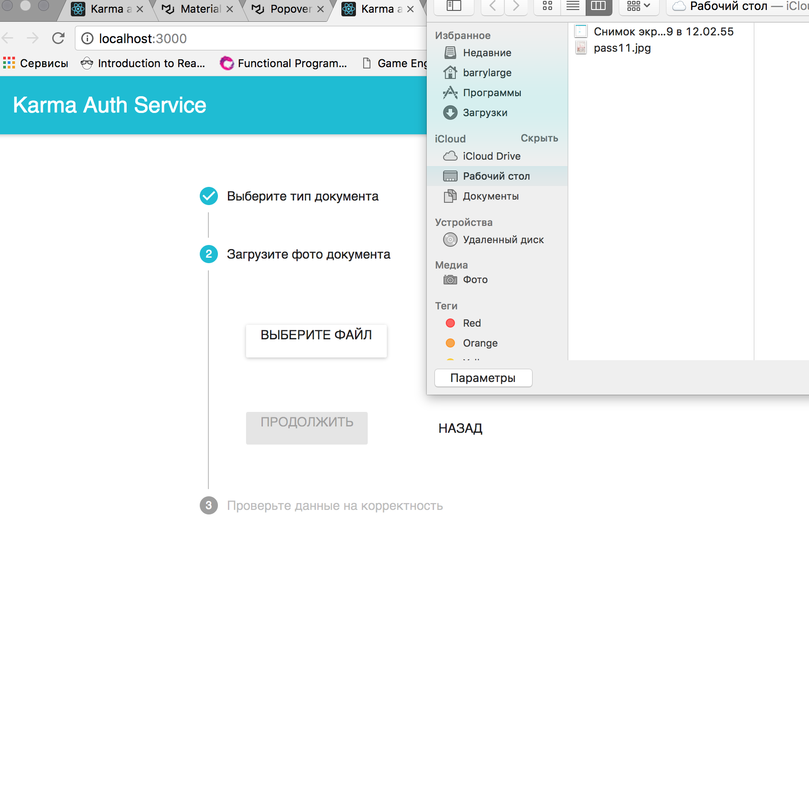

# Karma Auth App (Web-client😎)
> Autocomplete the user profile form from the document's photo

##### Assumption:
Continuing the theme of the development of Karma as a platform:
we want to provide network members with the organization of additional services.
So, for example, one of the infrastructural elements of the system is a
service or company that performs KYC authorization of a potential
borrower or creditor, with the possibility to publish information
about a particular purse in the public distributed register of Karma
without publishing information about its owner's personal data.
_One of the needs of such a service is a simple and quick way to fill out all forms
associated with the client's personalization._ For example,
on the site of such a company.

##### Idea:
The user photographs the document at registration, and the profile of
the Karma wallet user is automatically populated from the fields of the identity document,
without needing to score the fields with his hands.
And you can also scan the property registration
certificate / driver's license and other documents and
fill out the data required for applying for a loan from Karma.

> [Reference photo for checking the application](https://drive.google.com/drive/folders/1wbArlgHHJiRz9vYOU0CugtXWScsi8lKU) 👈

## Objectives

* [ ] Code refactor
* [ ] Use *CV library on server/client side to crop *white-space\* on image
* [ ] Use \*CV library on server/client side to text block allocation
* [ ] Research on image optimization algorithms to improve the quality of allocated blocks
* [ ] Add several documents types to autocomplete list

## Interaction scheme


## Screenshots


---

### [Andorid appliction](https://github.com/LexLeontiev/karmaauth)👈

### [Server application]()👈

### Web application build with:

#### Frontend Webpack boilerplate
#### _Contains_

* [x] [Typescript](https://www.typescriptlang.org/) 2.7
* [x] [React](https://facebook.github.io/react/) 16
* [x] [React Router](https://github.com/ReactTraining/react-router) 4.2
* [x] [Mobx](https://github.com/mobxjs/mobx)
* [x] [Mobx React](https://github.com/mobxjs/mobx-react)
* [x] [Mobx React Router](https://github.com/alisd23/mobx-react-router/)
* [x] [Mobx React Devtools](https://github.com/mobxjs/mobx-react-devtools)

#### _Build tools_

* [x] [Webpack](https://webpack.github.io) 4
  * [x] [Tree Shaking](https://webpack.js.org/guides/tree-shaking/)
  * [x] [Webpack Dev Server](https://github.com/webpack/webpack-dev-server)
* [x] [Typescript Loader](https://github.com/TypeStrong/ts-loader)
* [x] [PostCSS Loader](https://github.com/postcss/postcss-loader)
  * [x] [CSS next](https://github.com/MoOx/postcss-cssnext)
  * [x] [CSS modules](https://github.com/css-modules/css-modules)
* [x] [React Hot Loader](https://github.com/gaearon/react-hot-loader)
* [x] [ExtractText Plugin](https://github.com/webpack/extract-text-webpack-plugin)
* [x] [HTML Webpack Plugin](https://github.com/ampedandwired/html-webpack-plugin)

### Setup

```
$ npm install
```

### Running

```
$ npm start
```

### Build

```
$ npm run build
```

### Code Format

```
$ npm run prettier
```

### License

MIT
